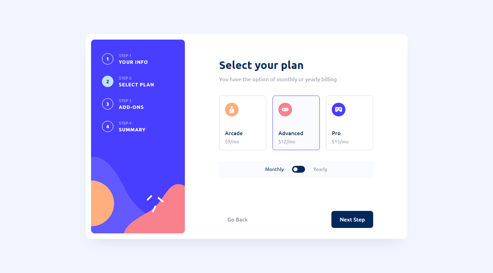

# Multi-Step Form

## Challenge
This challenge involves a form allowing the user to set up a plan for an online gaming service. The form consists of 5 screens. The
first three prompt the user to input information about themselves and their preferred plan options. The fourth screen displays a summary of
the user's choices along with their total billing cost. The final screen displays a thank you message.

Users should be able to:

- Complete each step of the sequence
- See a summary of their selections on the final step and confirm their order
- View the optimal layout for the interface depending on their device's screen size
- See hover and focus states for all interactive elements on the page

### Links

- [Solution](https://www.frontendmentor.io/solutions/responsive-multistep-form-using-react-typescript-J2CEYngJgZ)
- [Live Site](https://fm-multistep-form.netlify.app/)

### Built with

- React w/ Typescript
- React Context
- CSS Styled Components
- Flexbox
- Desktop-first workflow

## Author

- Frontend Mentor [@Isaiah-B](https://www.frontendmentor.io/profile/Isaiah-B)
